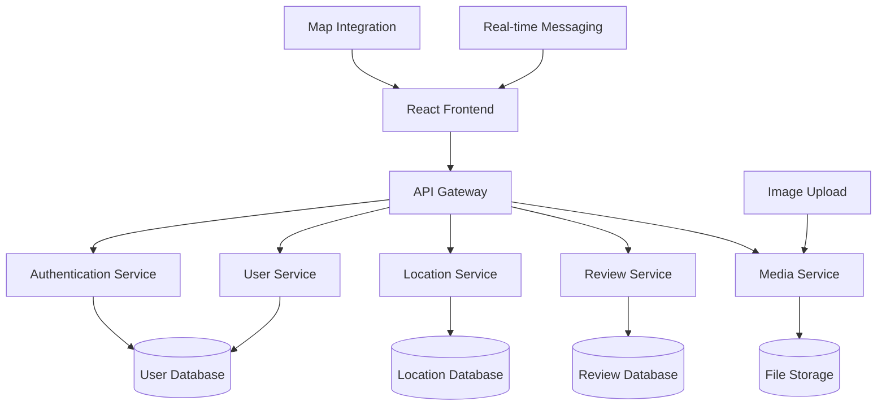

# Design Document

## Overview

The Offbeat Travel App is a React-based web application that connects travelers with locals through a community-driven recommendation system. The platform emphasizes authentic, off-the-beaten-path experiences by leveraging local knowledge and traveler feedback. The system uses a modern web stack with real-time features for community interaction and geographic data handling for location-based services.

## Architecture

### High-Level Architecture



### Technology Stack

- **Frontend**: React 18 with TypeScript, Vite for build tooling
- **State Management**: React Context API with useReducer for complex state
- **Routing**: React Router v6 for client-side navigation
- **UI Components**: Custom components with CSS modules for styling
- **Maps**: Integration with mapping service (Leaflet/OpenStreetMap)
- **HTTP Client**: Fetch API with custom hooks for data fetching
- **Form Handling**: React Hook Form for form validation and submission
- **Image Handling**: File upload with preview and compression

## Components and Interfaces

### Core Components

#### 1. Location Components
- `LocationCard`: Displays location summary with photos and ratings
- `LocationDetail`: Full location page with all recommendations and reviews
- `LocationForm`: Form for locals to submit new location recommendations
- `LocationMap`: Interactive map showing location pins and clusters
- `LocationSearch`: Search and filter interface for finding locations

#### 2. User Components
- `UserProfile`: Display user information, expertise, and activity history
- `UserAuth`: Login/registration forms with validation
- `UserDashboard`: Personal dashboard showing saved locations and activity
- `UserMessaging`: Direct messaging interface between users

#### 3. Review Components
- `ReviewCard`: Individual review display with photos and ratings
- `ReviewForm`: Form for travelers to submit experience reviews
- `ReviewList`: Paginated list of reviews for a location
- `RatingDisplay`: Star rating component with aggregate scores

#### 4. Media Components
- `PhotoGallery`: Image carousel for location and review photos
- `PhotoUpload`: Drag-and-drop image upload with preview
- `ImageOptimizer`: Client-side image compression and resizing

### Data Interfaces

#### Location Interface
```typescript
interface Location {
  id: string;
  name: string;
  description: string;
  specialtyDescription: string;
  coordinates: {
    latitude: number;
    longitude: number;
  };
  category: LocationCategory;
  submittedBy: string;
  photos: Photo[];
  averageRating: number;
  reviewCount: number;
  createdAt: Date;
  verified: boolean;
}
```

#### User Interface
```typescript
interface User {
  id: string;
  username: string;
  email: string;
  userType: 'local' | 'traveler' | 'both';
  profile: {
    bio: string;
    location: string;
    expertise: string[];
    avatar: string;
  };
  reputation: number;
  joinedAt: Date;
}
```

#### Review Interface
```typescript
interface Review {
  id: string;
  locationId: string;
  userId: string;
  rating: number;
  title: string;
  content: string;
  photos: Photo[];
  visitDate: Date;
  createdAt: Date;
  helpfulVotes: number;
}
```

## Data Models

### Database Schema Design

#### Users Table
- Primary key: user_id (UUID)
- Fields: username, email, password_hash, user_type, profile_data, reputation_score
- Indexes: email (unique), username (unique)

#### Locations Table
- Primary key: location_id (UUID)
- Fields: name, description, specialty_description, latitude, longitude, category, submitted_by
- Indexes: coordinates (spatial), category, submitted_by
- Foreign keys: submitted_by → users.user_id

#### Reviews Table
- Primary key: review_id (UUID)
- Fields: location_id, user_id, rating, title, content, visit_date, helpful_votes
- Indexes: location_id, user_id, rating
- Foreign keys: location_id → locations.location_id, user_id → users.user_id

#### Photos Table
- Primary key: photo_id (UUID)
- Fields: entity_type, entity_id, file_path, caption, upload_date
- Indexes: entity_type + entity_id
- Supports both location and review photos

### State Management

#### Global State Structure
```typescript
interface AppState {
  user: {
    currentUser: User | null;
    isAuthenticated: boolean;
    loading: boolean;
  };
  locations: {
    items: Location[];
    selectedLocation: Location | null;
    searchFilters: SearchFilters;
    loading: boolean;
  };
  reviews: {
    items: Review[];
    loading: boolean;
  };
  ui: {
    mapView: boolean;
    sidebarOpen: boolean;
    notifications: Notification[];
  };
}
```

## Error Handling

### Client-Side Error Handling
- **Network Errors**: Retry mechanism with exponential backoff
- **Validation Errors**: Real-time form validation with user-friendly messages
- **Authentication Errors**: Automatic redirect to login with return URL
- **File Upload Errors**: Progress indication and error recovery options

### Error Boundary Implementation
- Global error boundary for unhandled React errors
- Component-specific error boundaries for critical sections
- Error logging and user feedback mechanisms
- Graceful degradation for non-critical features

### API Error Responses
- Standardized error response format with error codes
- User-friendly error messages for common scenarios
- Detailed error information for development environments
- Rate limiting and abuse prevention measures

## Testing Strategy

### Unit Testing
- Component testing with React Testing Library
- Custom hook testing for data fetching logic
- Utility function testing for data transformation
- Form validation testing with various input scenarios

### Integration Testing
- API integration testing with mock services
- User flow testing for critical paths (registration, location submission, review posting)
- Map integration testing for location display and interaction
- File upload testing with various file types and sizes

### End-to-End Testing
- Complete user journeys from registration to location discovery
- Cross-browser compatibility testing
- Mobile responsiveness testing
- Performance testing for large datasets and image loading

### Testing Tools
- Jest for unit testing framework
- React Testing Library for component testing
- MSW (Mock Service Worker) for API mocking
- Cypress for end-to-end testing scenarios